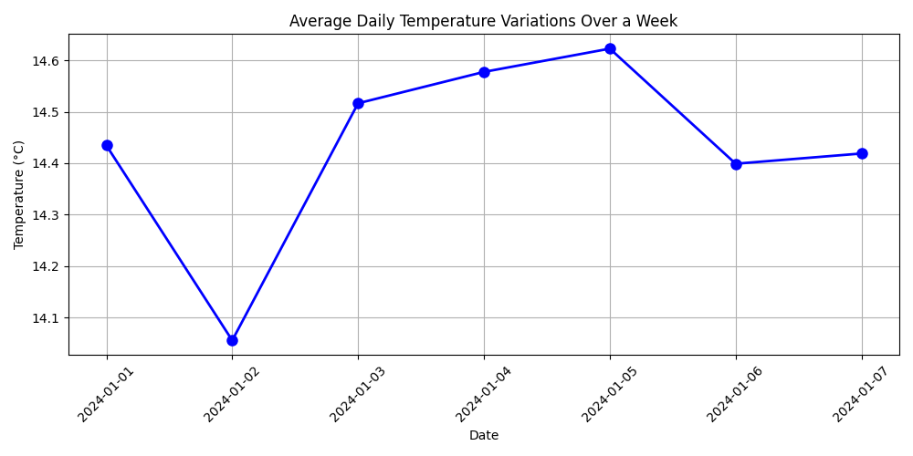
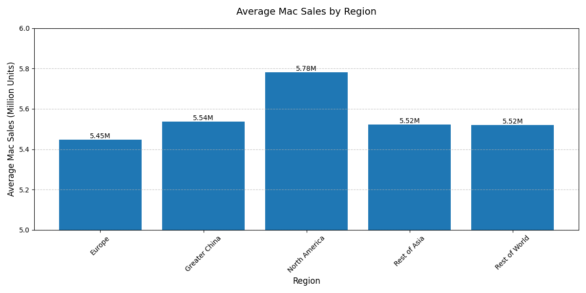

# Python Practice Repository

## Overview
This repository contains implementations of various Python programming concepts, data manipulation, and visualization techniques using popular libraries like NumPy, Pandas, and Matplotlib. 

## Basic Python Data Structures

### List Operations
- Implementation in `list.py`
- Functionality: Remove duplicates and sort numbers in ascending order
- Reference: [GeeksforGeeks - Remove Duplicates from List](https://www.geeksforgeeks.org/python-ways-to-remove-duplicates-from-list/)

### Set Operations
- Implementation in `set.py`
- Functionality: Find common elements between two lists using sets
- Reference: [W3Schools - Set Operations](https://www.w3schools.com/python/ref_set_intersection.asp)

### Tuple Operations
- Implementation in `tuple.py`
- Functionality: Create and manage student records (name, age, grade) using tuples
- Features: Sorting by grade

### Dictionary Operations
- Implementation in `Dictionary.py`
- Functionality: Word occurrence counter in text
- Features: Text analysis and frequency counting

## NumPy Operations

### Matrix Operations (numpy_1.py)
- Generated 5x5 random integer matrix using `np.random.randint`
- Computed row-wise sums using `np.sum` with axis parameter
- Features: Matrix manipulation and aggregation

### Array Normalization (numpy_2.py)
- Generated 100 random values using `np.random.rand`
- Normalized array using the formula: (x - min(x)) / (max(x) - min(x))
- Features: Array generation and normalization techniques

## Pandas Data Analysis

### Revenue Analysis (pandas_1.py)
- Dataset: Furniture sales data (`data/Furniture.csv`)
- Features:
  - Grouping data by product category
  - Calculating total revenue and sales
  - Aggregation techniques using pandas

### Missing Value Treatment (pandas_2.py)
- Dataset: Furniture data with missing values
- Features:
  - Null value detection using `isnull()`
  - Separation of numeric columns
  - Column-wise mean calculation
  - Missing value imputation using `fillna`
- Output: Cleaned dataset saved as `Furniture_filled.csv`

## Data Visualization with Matplotlib

### Temperature Variation Analysis (matplotlib_1.py)
- Dataset: Weather data (`data/first_week_weather.csv`)
- Features:
  - DateTime conversion and processing
  - Daily temperature aggregation
  - Line plot with customizations:
    - Markers and line styles
    - Axis labels and titles
    - Grid and layout adjustments

#### Output

*Figure: Line chart showing average daily temperature variations over the first week of 2024*

### Regional Sales Analysis (matplotlib_2.py)
- Dataset: Apple sales data (`data/apple_sales_2024.csv`)
- Features:
  - Regional Mac sales analysis
  - Bar chart creation with:
    - Value labels on bars
    - Custom formatting and styling
    - Grid lines for readability
    - Optimized layout

#### Output

*Figure: Bar chart comparing average Mac sales across different regions*

## Datasets
- Weather Data: `first_week_weather.csv` (Source: Kaggle Weather Dataset)
- Apple Sales Data: `apple_sales_2024.csv` (Source: Kaggle Sales Data)
- Furniture Sales: `Furniture.csv` (Source: Kaggle Retail Dataset)

## Helper Scripts
- `Download_Dataset.py`: Dataset download and preparation
- `wrangling.py`: Data preprocessing utilities

## Dependencies
- NumPy: Array operations and numerical computations
- Pandas: Data manipulation and analysis
- Matplotlib: Data visualization
